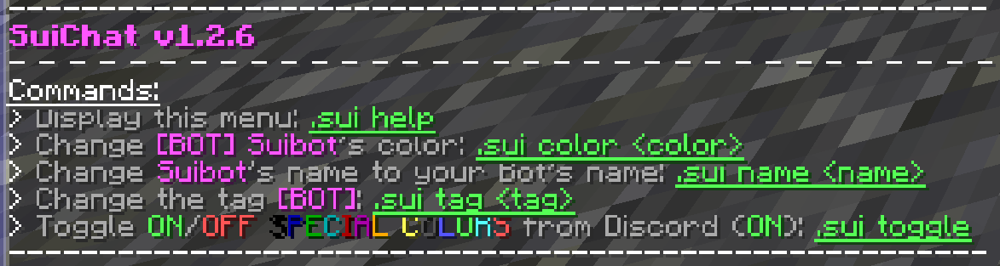

# SuiChat
ChatTriggers module to make Suibot ([Hypixel's guild chat minecraft-discord-bridge](https://github.com/Senither/hypixel-discord-chat-bridge)) look fancier.

# Installation
1. Install [ChatTriggers](https://www.chattriggers.com) 1.3.0 or above for Minecraft 1.8.9.
2. Type **/ct import suichat** in chat.
3. Type **.sui name \<name\>** to configure it to use your Bot account's name.
4. *(Optionally)* Type **.sui help** to see the available commands and customize what you want.

# ChatTriggers Link
https://www.chattriggers.com/modules/v/SuiChat
